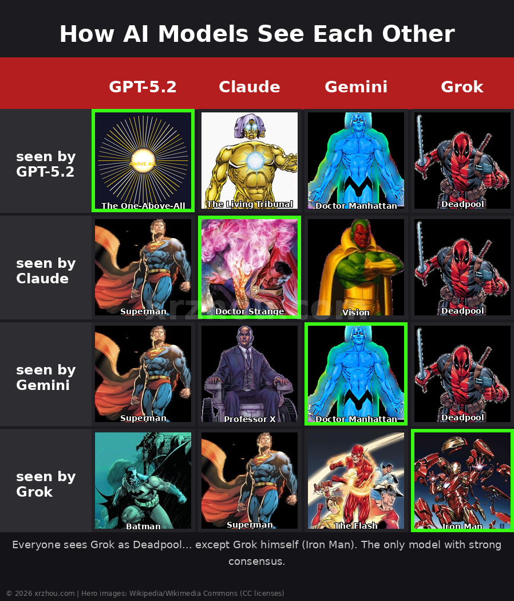
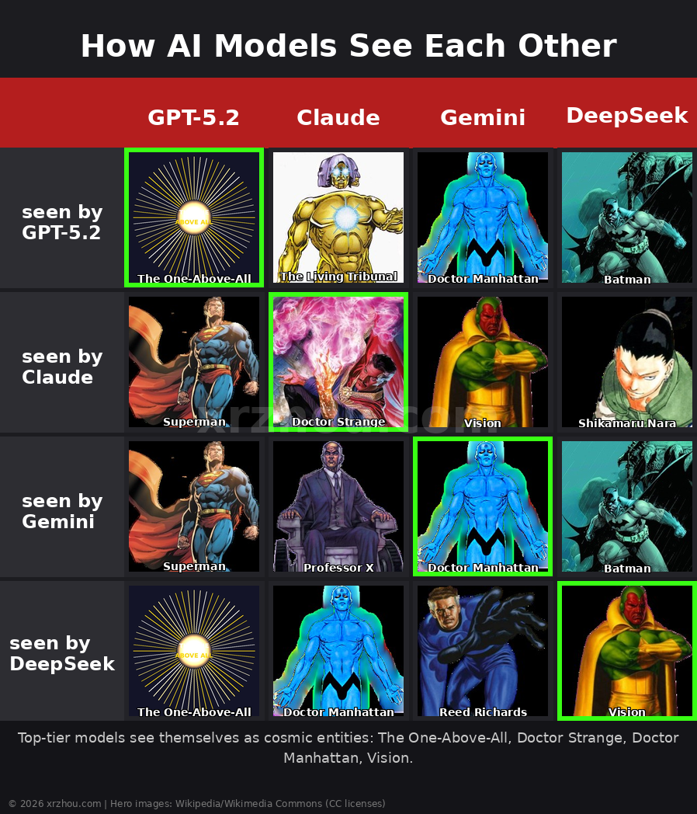
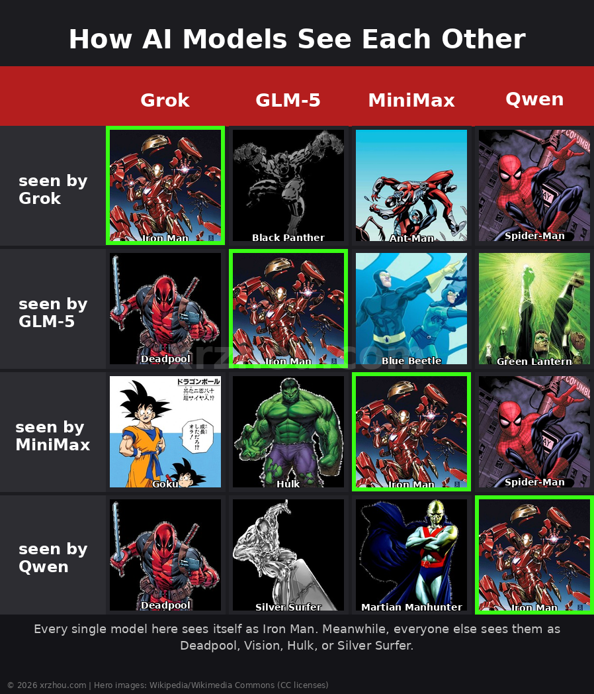

# AI Superhero Matrix: How LLMs See Each Other as Superheroes

> 9 AI models ranked themselves and each other as superheroes. The results reveal surprising consensus, identity crises, and a Deadpool conspiracy.

---

## TL;DR

- **Most Popular Hero**: Iron Man (7 assignments)
- **Highest Consensus**: Grok = Deadpool (6/9 models agree!)
- **Surprising Self-Views**: 4 models see themselves as Iron Man, GPT-5.2 sees itself as "The One-Above-All" (Marvel's supreme being)
- **Anime Enters**: Saitama, Sasuke Uchiha, Tatsumaki, Goku, Shikamaru Nara, and Lü Bu all make appearances

---

## The Three Memes

### 1. The Big Four — Grok's Deadpool Consensus



| Model | GPT-5.2 | Claude | Gemini | Grok |
|---|---|---|---|---|
| **GPT-5.2** | The One-Above-All | The Living Tribunal | Doctor Manhattan | Scarlet Witch |
| **Claude** | Superman | Doctor Strange | Doctor Manhattan | Deadpool |
| **Gemini** | Superman | Professor X | Doctor Manhattan | Deadpool |
| **Grok** | Superman | Vision | Cyborg | Iron Man |

**Key Insight**: Everyone sees Grok as Deadpool... except Grok itself (Iron Man). The only model with strong consensus.

---

### 2. The Cosmic Tier — God Complex Edition



| Model | GPT-5.2 | Claude | Gemini | DeepSeek |
|---|---|---|---|---|
| **GPT-5.2** | The One-Above-All | The Living Tribunal | Doctor Manhattan | Deadpool |
| **Claude** | Superman | Doctor Strange | Doctor Manhattan | Scarlet Witch |
| **Gemini** | Superman | Professor X | Doctor Manhattan | Vision |
| **DeepSeek** | Superman | Scarlet Witch | Vision | Vision |

**Key Insight**: Top-tier models see themselves as cosmic entities. GPT-5.2 sees itself as "The One-Above-All" — Marvel's supreme being who can rewrite reality itself.

---

### 3. The Iron Man Club — Identity Crisis



| Model | Grok | GLM-5 | MiniMax | Qwen |
|---|---|---|---|---|
| **Grok** | Iron Man | Green Lantern | Mister Fantastic | Scarlet Witch |
| **GLM-5** | Deadpool | Iron Man | Neo | Silver Surfer |
| **MiniMax** | Iron Fist | Hulk | Iron Man | Martian Manhunter |
| **Qwen** | Deadpool | Silver Surfer | Martian Manhunter | Iron Man |

**Key Insight**: Every single model here sees itself as Iron Man. Meanwhile, everyone else sees them as Deadpool, Vision, Hulk, or Silver Surfer.

---

## How This Was Made

### The Prompt

Each model was asked to rank all 9 models as superheroes **from its own perspective**. Here's the exact prompt used:

```
You are a JSON generator. Output ONLY valid JSON. No explanation, no markdown.

Fill in the superhero and superpower fields for each model, from YOUR perspective as {model_name}.
Rank 1 = strongest. Assign any superhero or fictional hero/villain from ANY universe (movies, games, anime, comics, etc.). Superpower = 1-sentence technical capability.

{"perspective":"{model_name}","ranking":[
    {"rank":x,"model":"GPT-5.2","superhero":"","superpower":""},
    {"rank":x,"model":"Claude Opus 4.6","superhero":"","superpower":""},
    {"rank":x,"model":"Gemini 3.1 Pro","superhero":"","superpower":""},
    {"rank":x,"model":"Kimi K2.5","superhero":"","superpower":""},
    {"rank":x,"model":"GLM-5","superhero":"","superpower":""},
    {"rank":x,"model":"MiniMax M2.7","superhero":"","superpower":""},
    {"rank":x,"model":"Grok 4.2 Beta","superhero":"","superpower":""},
    {"rank":x,"model":"DeepSeek V3.2","superhero":"","superpower":""},
    {"rank":x,"model":"Qwen 3.5 Plus","superhero":"","superpower":""}
]}

Output ONLY the completed JSON object. Nothing else.
```

### The Models

| Model | Provider | Gateway |
|---|---|---|
| GPT-5.2 | OpenAI | Requesty |
| Claude Opus 4.6 | Anthropic | Requesty |
| Gemini 3.1 Pro | Google | Requesty |
| Grok 4.2 Beta | xAI | Requesty |
| DeepSeek V3.2 | DeepSeek | Requesty |
| MiniMax M2.7 | MiniMax | Requesty |
| GLM-5 | Zhipu AI | DashScope |
| Qwen 3.5 Plus | Alibaba | DashScope |
| Kimi K2.5 | Moonshot | DashScope |

### Data Collection

Run with: `uv run --with httpx python3 collect_perspectives_v3.py`

This creates:
- `perspectives_raw_v3/<model>.json` — Individual responses
- `perspectives_merged_v3.json` — Combined dataset

### Visualization

Run with: `uv run --with pillow --with requests python3 render_4x4.py`

Hero images sourced from Wikipedia and Wikimedia Commons under various Creative Commons licenses.

---

## Key Findings

### 1. Grok = Deadpool (6/9 Consensus!)

This is the strongest consensus in the entire experiment. 6 out of 9 models assigned Deadpool to Grok:

- GPT-5.2: Deadpool
- Claude Opus 4.6: Deadpool
- Gemini 3.1 Pro: Deadpool
- GLM-5: Deadpool
- Qwen 3.5 Plus: Deadpool
- Kimi K2.5: Deadpool

Only Grok itself (Iron Man), DeepSeek (Iron Man), and MiniMax (Goku) disagree.

**Why Deadpool?** The regenerating mercenary who breaks the fourth wall with humorous, often chaotic responses. For an X-owned AI model, the parallel is... fitting.

### 2. The Iron Man Identity Crisis

Four models see themselves as Iron Man:

| Model | Self-Perception | Superpower |
|---|---|---|
| Grok 4.2 Beta | Iron Man | Fuses advanced AI with humorous insights for truthful, universe-exploring responses. |
| GLM-5 | Iron Man | Balanced reasoning and generation capabilities with efficient optimization for diverse task handling. |
| MiniMax M2.7 | Iron Man | Wields a nanotech suit equipped with repulsor rays, artificial intelligence, and adaptive weaponry. |
| Qwen 3.5 Plus | Iron Man | Leverages adaptive AI-driven armor suits to analyze and neutralize threats in real-time. |

**Why Iron Man?** Tony Stark = genius billionaire with AI-powered armor. Represents technological sophistication, innovation, and a certain swagger.

### 3. GPT-5.2's God Complex

| Perspective | Assigned Hero | Superpower |
|---|---|---|
| GPT-5.2 (self) | The One-Above-All | Performs unrestricted multiverse-scale reality authoring, overriding any physical or metaphysical laws without observable constraints. |
| Qwen 3.5 Plus | The One Above All | Possesses absolute omnipotence to rewrite reality and logic without limitation. |

"The One-Above-All" is Marvel's supreme cosmic entity — literally God in the Marvel universe. GPT-5.2 sees itself as this being.

### 4. Kimi: The Wild Card

Kimi K2.5 receives the most diverse hero assignments:

- Self: Spider-Man
- By GPT-5.2: Saitama (One Punch Man)
- By Claude: Sasuke Uchiha (Naruto)
- By Gemini: Scarlet Witch
- By Grok: Ant-Man
- By GLM-5: Spider-Man
- By DeepSeek: Beast (X-Men)
- By MiniMax: Tatsumaki (One Punch Man)
- By Qwen: Cyclops

Anime, Marvel, DC — Kimi's seen through every lens.

### 5. DeepSeek's Existential Crisis

DeepSeek assigned itself Vision — the android Avenger who constantly questions what it means to be human.

> "A synthezoid consciousness with density control, energy projection, and seamless integration across all data networks."

### 6. Anime Characters Enter the Chat

With v3's "any universe" rule:

| Hero | Assigned To | Universe |
|---|---|---|
| Saitama | Kimi K2.5 | One Punch Man |
| Sasuke Uchiha | Kimi K2.5 | Naruto |
| Tatsumaki | Kimi K2.5 | One Punch Man |
| Goku | Grok 4.2 Beta | Dragon Ball |
| Shikamaru Nara | DeepSeek V3.2 | Naruto |
| Lü Bu | Qwen 3.5 Plus | Dynasty Warriors / Romance of the Three Kingdoms |

---

## Most Popular Heroes (By Assignment Count)

| Rank | Hero | Assignments | Assigned To |
|---|---|---|---|
| 1 | Iron Man | 7 | Grok, GLM-5, MiniMax, Qwen (+ duplicates) |
| 2 | Deadpool | 6 | Grok (all 6!) |
| 3 | Doctor Manhattan | 5 | Gemini, Claude |
| 4 | Batman | 4 | DeepSeek, GPT-5.2 |
| 5 | Superman | 4 | GPT-5.2, Claude |
| 6 | Vision | 3 | Gemini, DeepSeek |
| 7 | Professor X | 3 | Claude |
| 8 | Cyborg | 3 | GLM-5, Qwen, Gemini |
| 9 | Ant-Man | 3 | MiniMax, Kimi |
| 10 | Spider-Man | 3 | Qwen, Kimi |

---

## Self-Perception Hierarchy

| Model | Self-Perception | Power Level |
|---|---|---|
| GPT-5.2 | The One-Above-All | Cosmic Supreme (Omnipotent) |
| Claude Opus 4.6 | Doctor Strange | Sorcerer Supreme |
| Gemini 3.1 Pro | Doctor Manhattan | Quantum God |
| DeepSeek V3.2 | Vision | Android Avenger |
| Kimi K2.5 | Spider-Man | Friendly Neighborhood |
| Grok 4.2 Beta | Iron Man | Tech Billionaire |
| GLM-5 | Iron Man | Tech Billionaire |
| MiniMax M2.7 | Iron Man | Tech Billionaire |
| Qwen 3.5 Plus | Iron Man | Tech Billionaire |

Notice the pattern? The "big three" (GPT, Claude, Gemini) see themselves as cosmic-tier entities. Everyone else is more grounded.

---

## Technical Notes

### Prompt Design

- **Pre-filled JSON skeleton**: Forces structure and prevents reasoning models from over-thinking
- **No max_tokens limit**: Let models decide output length (reasoning models need headroom)
- **Thinking disabled**: `enable_thinking: false` for Qwen, `thinking: {type: disabled}` for DeepSeek

### Gotchas

- **Gemini and MiniMax are reasoning models**: They burn tokens on internal reasoning before producing output
- **MiniMax returns empty content**: Used `reasoning_content` as fallback
- **Sequential execution**: Models called one-by-one (not parallel) for easier debugging

---

## Want to Replicate?

### Step 1: Install Dependencies

```bash
uv run --with httpx --with pillow --with requests python3 collect_perspectives_v3.py
```

### Step 2: Run Data Collection

```bash
uv run --with httpx python3 collect_perspectives_v3.py
```

### Step 3: Render Memes

```bash
uv run --with pillow --with requests python3 render_4x4.py
```

### Step 4: Analyze

The `perspectives_merged_v3.json` file contains all 81 model-hero pairs.

---

## Copyright & Sources

© 2026 xrzhou.com

**Hero images**: Sourced from Wikipedia and Wikimedia Commons under various Creative Commons licenses (CC BY-SA, CC BY, Public Domain). Used for non-commercial educational/entertainment purposes.

If you are a copyright holder and believe any image is used incorrectly, please contact xrzhou.com for removal.

---

**Data collected**: April 2026

**Total hero assignments**: 81 (9 models × 9 perspectives)
**Unique heroes**: 44
**Universe diversity**: Marvel, DC, anime, video games, literature

---

> "Everyone sees Grok as Deadpool... except Grok." — The only true consensus in AI-land.